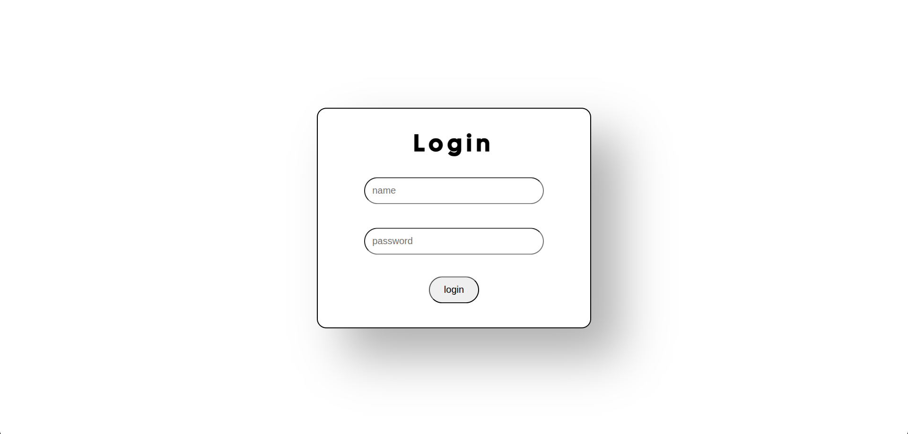

# Login From With nodejs & express

before running this code make sure you have installed mysql, nodejs, and npm, then connect the database from your mysql to the app.js file. After that you can run the command on your vscode terminal

`npm install` to install the required packages

and to run the code run this command 
`npm start` 

then open your browser application and write
`localhost:3030`

